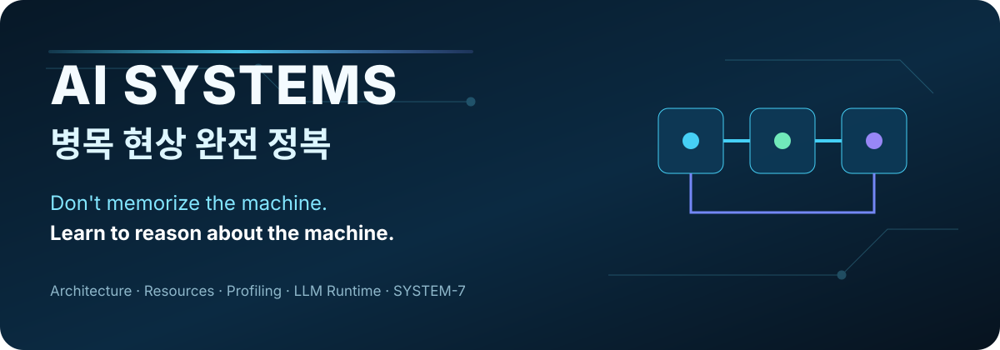

<p align="center">
  
</p>

<p align="center">
  <strong>좋은 추상화와 도구는 최대한 활용하되, 추상화가 깨지는 순간 한두 계층 아래로 내려가 원인을 찾는 법.</strong>
</p>

<p align="center">
  <a href="book/AI_Systems_Bottleneck_KR.pdf"><strong>📖 Read Korean Edition</strong></a>
  ·
  <a href="book/AI_Systems_Bottleneck_KR.pdf?raw=1"><strong>⬇️ Download PDF</strong></a>
  ·
  <a href="#english-edition"><strong>🌐 English Edition</strong></a>
</p>

<p align="center">
  <code>Korean Edition v1.1</code> · <code>Free PDF</code> · <code>79 pages</code> · <code>AI-assisted learning</code>
</p>

---

## 왜 이 책을 만들었나

AI가 코드를 작성하고, 라이브러리를 추천하고, 오류 원인까지 빠르게 제시하는 시대에 이런 고민이 남았습니다.

> **AI 시대에도 로우레벨 / 머신 레벨 지식을 공부해야 할까?**
>
> 그렇다면 어디까지 내려가야 하고, 어디부터는 이미 잘 만들어진 도구를 써야 할까?

모든 것을 밑바닥부터 다시 구현하는 것은 좋은 답이 아니었습니다. 반대로 AI와 프레임워크가 알아서 해준다는 이유로 시스템 내부를 전혀 모르는 것도, 실제 병목이나 장애를 만나는 순간 한계가 있었습니다.

이 책이 선택한 답은 다음과 같습니다.

> **Don't memorize the machine. Learn to reason about the machine.**

평소에는 가장 좋은 추상화와 도구를 사용합니다. 하지만 성능이 떨어지고, 메모리가 부족하고, GPU가 놀고 있고, 요청이 밀리거나 비용이 급증한다면 **구조를 그리고 → 측정하고 → 가설을 세우고 → 반박하고 → 최소한으로 수정한 뒤 → 다시 검증합니다.**

이 책은 그 사고 습관을 훈련하기 위해 만들어졌습니다.

---

## 이 책이 다루는 것

- CPU, RAM, SSD, Network, GPU, VRAM의 **자원 감각**
- 프로그램과 데이터가 실제 시스템을 통과하는 **아키텍처와 흐름**
- latency, throughput, queue, backpressure, I/O와 **기다림의 원인**
- `htop`, `nvidia-smi`, profiler, trace 등으로 **느낌 대신 증거를 만드는 법**
- Local LLM의 context, KV cache, TTFT, tok/s, quantization, VRAM
- CPU ↔ GPU 데이터 이동과 compute-bound / memory-bound 사고
- 불완전한 장애 정보를 가지고 원인을 좁히는 **Field Incident Lab**
- AI를 정답 생성기가 아니라 **튜터·반대 가설 생성기·실험 설계자**로 사용하는 방법

---

## SYSTEM-7

책 전체에서 같은 문제 해결 루프를 반복합니다.

```text
MAP → OBSERVE → LOCALIZE → HYPOTHESIZE → FALSIFY → INTERVENE → VERIFY
```

| Step | 질문 |
|---|---|
| **Map** | 시스템은 어떤 계층과 자원으로 구성되어 있는가? |
| **Observe** | 실제로 어떤 숫자가 변했는가? |
| **Localize** | 문제가 발생하는 계층을 어디까지 좁힐 수 있는가? |
| **Hypothesize** | 가능한 원인은 무엇인가? |
| **Falsify** | 어떤 관측값이 이 가설을 틀렸다고 증명할 수 있는가? |
| **Intervene** | 가장 작고 값싼 수정은 무엇인가? |
| **Verify** | Before / After 측정에서 실제 개선이 있었는가? |

---

## 누구를 위한 책인가

이 책은 전통적인 CS 전공 교재를 목표로 하지 않습니다.

다음 정도라면 시작할 수 있습니다.

- 개발을 조금이라도 접해봤다.
- Python 또는 JavaScript 코드를 AI 도움으로 읽을 수 있다.
- 터미널 명령어를 실행해본 적이 있다.
- AI / Local LLM / Agent / 시스템 성능에 관심이 있다.

C/C++, 운영체제 전공 지식, 미적분, 전자공학은 선수조건이 아닙니다.

대신 목표는 초급에서 끝나지 않습니다. 책을 마친 뒤에는 낯선 시스템에서도 **자원이 어디서 소비되고 무엇이 기다리는지 추론하고, 측정으로 가설을 좁힐 수 있는 실전형 시스템 사고**를 목표로 합니다.

---

## 학습 흐름

```text
Feel the Machine
      ↓
See the System
      ↓
Find the Wait
      ↓
Measure Before Guessing
      ↓
AI Systems
      ↓
Diagnose
      ↓
Improve & Verify
```

### 주요 구성

**Part 0 — Feel the Machine**  
CPU · RAM · SSD · Network · GPU · VRAM을 실제로 움직여 보며 숫자 감각을 만듭니다.

**Part I — See the System**  
메모리 계층, OS, process/thread, async, 네트워크, 데이터 이동을 구조와 흐름으로 봅니다.

**Part II — AI Runtime & GPU**  
GPU, Local LLM, KV cache, TTFT, profiling, compiler/kernel을 필요한 깊이까지 내려갑니다.

**Part III — Simulation, Lab & Field Diagnosis**  
정답이 바로 보이지 않는 Incident, 12주 로드맵, Capstone을 통해 실제 추론을 훈련합니다.

---

## 읽기 / 다운로드

### 🇰🇷 Korean Edition

- **Read on GitHub:** [AI_Systems_Bottleneck_KR.pdf](book/AI_Systems_Bottleneck_KR.pdf)
- **Download PDF:** [Raw PDF](book/AI_Systems_Bottleneck_KR.pdf?raw=1)
- Current version: **v1.1 — KR Final Lock**

> GitHub의 PDF 미리보기가 느린 환경에서는 `Download PDF`를 사용하는 편이 안정적입니다.

---

## English Edition

<a id="english-edition"></a>

**Native English Edition — in progress.**

한국어판을 단순 직역하지 않고, 동일한 curriculum과 학습 철학을 유지하면서 영어권 기술 독자가 자연스럽게 읽을 수 있도록 별도 에디션으로 제작할 예정입니다.

완성 후 같은 저장소에서 제공됩니다.

```text
book/
├── AI_Systems_Bottleneck_KR.pdf
└── AI_Systems_Bottleneck_EN.pdf   ← upcoming
```

---

## 피드백과 오타 제보

책을 실제로 따라가다가 다음을 발견하면 [Issues](../../issues)를 이용해 주세요.

- 오타 또는 깨진 텍스트
- 설명이 직관적이지 않은 부분
- 실습이 재현되지 않는 환경
- 잘못되었거나 모호한 기술 설명
- 더 좋은 반례 또는 Incident 사례

특히 **“정답이 틀렸다”보다 “이 설명으로는 이런 식으로 오해할 수 있다”**는 피드백을 환영합니다.

자세한 제보 방식은 [`CONTRIBUTING.md`](CONTRIBUTING.md)를 참고해 주세요.

---

## Repository Structure

```text
ai-systems-bottleneck-book/
│
├── README.md
├── CHANGELOG.md
├── CONTRIBUTING.md
│
├── book/
│   ├── AI_Systems_Bottleneck_KR.pdf
│   └── AI_Systems_Bottleneck_EN.pdf
│
├── assets/
│   ├── readme-banner.svg
│   ├── cover-ko.png
│   └── previews/
│
└── .github/
    └── ISSUE_TEMPLATE/
```

---

## Author

**SAPGUN**  
AI & Software Builder · Web3 · Sovereign AI · Open Systems

This project started from a practical question: **as AI makes implementation easier, what knowledge remains necessary to find and remove the bottlenecks underneath it?**

---

## License

The book is currently published for free reading and download. A formal content license will be specified before broader redistribution or derivative use.

Until then, copyright remains with the author.
